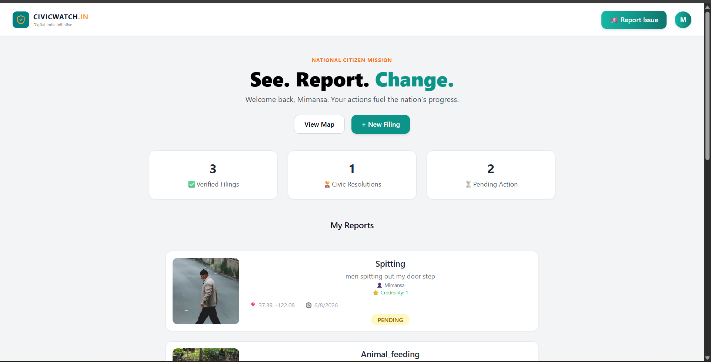
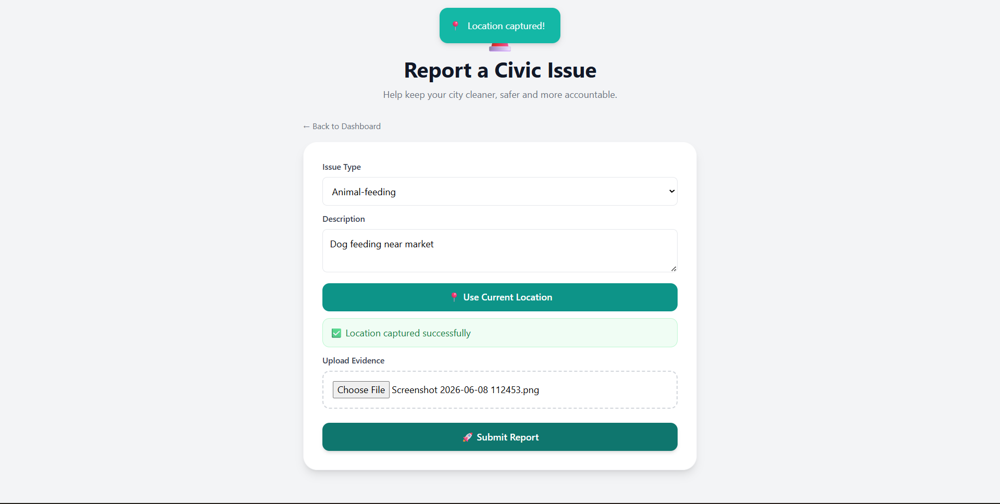
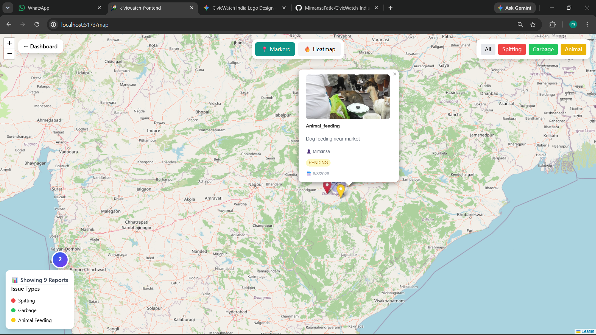
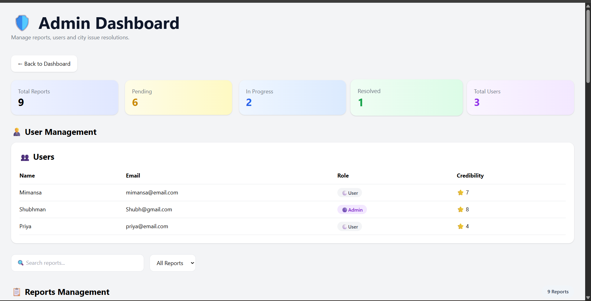

 # CivicWatch India 🇮🇳

A community-driven civic issue reporting platform that empowers citizens to report public issues such as garbage dumping, spitting, and animal feeding violations with image evidence and geolocation.

## 🚀 Features

* User Authentication (Register/Login)
* Report Civic Issues with Images
* Automatic Location Tracking
* Interactive Map View with Markers & Heatmaps
* Issue Type Filtering
* Admin Dashboard for Report Management
* Status Tracking (Pending, In Progress, Resolved)
* Leaderboard & Community Participation
* **New UI Upgrades:** Premium technical background grid patterns, custom circular watch favicon, and responsive SVG illustrations
* **Vector Iconography:** Clean `lucide-react` SVG icon integration throughout all views, forms, and navigation menus

## 🛠 Tech Stack

### Frontend

* React.js
* Tailwind CSS
* React Router
* Leaflet Maps

### Backend

* Node.js
* Express.js

### Database

* MongoDB Atlas

### Cloud Services

* Cloudinary (Image Storage)

## 📸 Screenshots

### Home Dashboard

### Report Issue

### Interactive Map

### Admin Dashboard

## 🏗 System Architecture

Citizen → React Frontend → Express API → MongoDB Atlas

Citizen → React Frontend → Cloudinary → Image Storage

Admin → Dashboard → Report Verification & Management

## 📈 Future Enhancements

* Mobile Application
* Real-Time Notifications
* AI-Based Issue Classification
* Government Department Integration
* Analytics Dashboard
* Multi-Language Support

## 👩‍💻 Developers

* **Frontend Developer:** Tirth Vaghela
* **Backend Developer:** Mimansa Patle

## ⭐ Project Objective

To encourage citizen participation in maintaining public cleanliness and civic responsibility through a digital reporting platform.

---

If you found this project interesting, consider giving it a ⭐ on GitHub.
